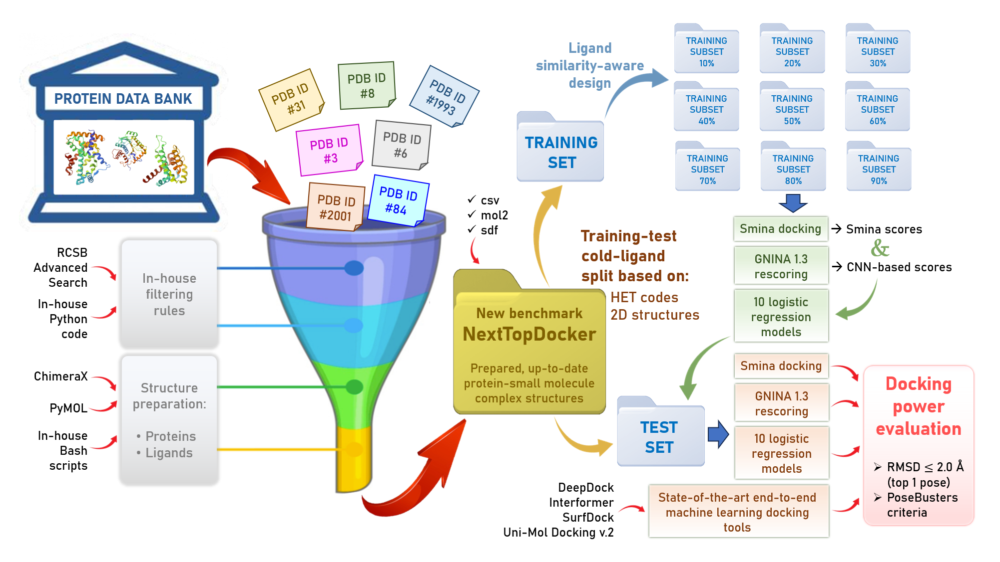

# NextTopDocker

NextTopDocker, a largest-scale, up-to-date (as of May 2025), and fully open-access data set of 19,239 PDB-derived protein-ligand complexes, split into 14,038 training and 5,201 test entries via a strict cold-ligand strategy, together with nine ligand-similarity-aware training subsets, provides a challenging, diverse, and reproducible foundation for evaluating pose generation and docking performance. 
In this benchmark test set, our simple logistic regression models, trained on Smina and GNINA 1.3 scores from chemically dissimilar ligands and applied to Smina-generated poses, achieved docking power comparable to or exceeding that of the four SOTA end-to-end ML docking tools (DeepDock, Interformer, SurfDock, and Uni-Mol Docking v.2).


## Workflow


## Dataset
All the dataset used to reproduce the result from the papaer can be found in: [NextTopDocker](https://drive.google.com/drive/folders/1_sO36_7-dlY9XuonvjkhKQDx1h6_aylT?usp=sharing), including NextTopDocker dataset and poses generated by four SOTA end-to-end ML docking tools.

Example of folder entry with PDB ID 1A28 in NextTopDocker dataset:
```
./NextTopDocker/1A28/
├── 1A28_ligand.mol2                 #ligand in mol2 format
├── 1A28_ligand.sdf                  #ligand in sdf format
├── 1A28_protein_posebuster.pdb      #target used to run PoseBuster
├── 1A28_receptor_dockprep.mol2      #target used to run Smina
├── gnina_result/                    #contains gnina 1.3 CNN rescores on Smina-generated poses
└── smina_result/                    #contains poses by Smina, both in .sdf and .mol2 format
```


## Installation
This code was tested in Python 3.12.8.

```
git clone https://github.com/caominhtr/NextTopDocker.git
cd NextTopDocker
conda env create -f NextTopDocker-env.yml
conda activate NextTopDocker
```

## Running LogReg (x%) model
To perform docking using our LogReg (x%) model, the following steps should be followed:

### Step 1: Input preparation
Ligand should be prepared in MOL2 file and named as '{ID}_ligand.mol2'. Protein should be prepared using using ChimeraX’s ‘DockPrep’ tool, saved in MOL2 file and named as '{ID}_protein.mol2'. Here is an example of input preparation:
```
example/
├── 1A28
│   ├── 1A28_ligand.mol2
│   ├── 1A28_protein.mol2
├── 1A54
│   ├── 1A54_ligand.mol2
│   ├── 1A54_protein.mol2
```

### Step 2: Perform docking and pose selection with LogReg (x%) model
Please specify the model(s) you want to use for predictions. You can select more than one model.

```
chmod +x logreg.sh
./logreg.sh <number_models>
```
Examples: Use model LogReg (10%), LogReg (40%), LogReg (70%) for pose predictions.
```
./logreg.sh 10 40 70
```

## Data


## Docking power evaluation on full test set

|Model | RMSD ≤ 2| RMSD ≤ 2 & PB-valid |
|--| ------------ | --- | 
|Smina| |  |
|Gnina 1.3| |  |
|LogReg (100%)| |  |
|LogReg (90%)| |  |
|LogReg (80%)| |  |
|LogReg (70%)| |  |
|LogReg (60%)| |  |
|LogReg (50%)| |  |
|LogReg (40%)| |  |
|LogReg (30%)| |  |
|LogReg (20%)| |  |
|LogReg (10%)| |  |
|DeepDock| |  |
|Interformer (Energy score)| |  |
|Interformer (Pose score)| |  |
|SurfDock| |  |
|Uni-Mol Docking v.2| |  |


---------------------------------------------------------------------------------------------------------------------------------------------------
This work was carried out at the Unité de Biologie Fonctionnelle et Adaptative (BFA), INSERM U1133, CNRS UMR8251, Université Paris Cité, France. The latest version of all data and source code provided herein was updated and made available free of charge in October 2025, and is subject to copyright.
