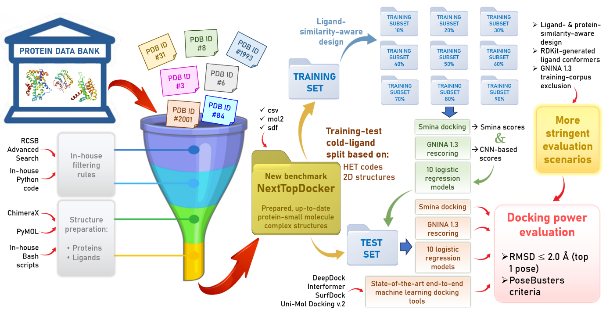

# NextTopDocker: a large-scale docking-power benchmark reveals limitations of current end-to-end machine-learning docking and the strength of hybrid rescoring
[](https://chemrxiv.org/doi/full/10.26434/chemrxiv.10001776/v1)

NextTopDocker, a largest-scale, up-to-date (as of May 2025), and fully open-access data set of 19,239 PDB-derived protein-ligand complexes, split into 14,038 training and 5,201 test entries via a strict cold-ligand strategy, together with nine ligand-similarity-aware training subsets, provides a challenging, diverse, and reproducible foundation for evaluating pose generation and docking performance. 

On this benchmark dataset, our simple logistic regression models, **LogReg (x%)**, trained on [Smina](https://pubs.acs.org/doi/10.1021/ci300604z) and [GNINA 1.3](https://jcheminf.biomedcentral.com/articles/10.1186/s13321-025-00973-x) scores from chemically dissimilar ligands and applied to Smina-generated poses, achieved docking power comparable to or exceeding that of the four SOTA end-to-end ML docking tools (DeepDock, Interformer, SurfDock, and Uni-Mol Docking v.2).

## Table of Contents

- [Dataset](#Dataset)
- [Installation](#Installation)
- [Running LogReg (x%)](#Running)
- [Interaction recovery rate](#Interaction)
- [Summary](#Summary)


<a id="set-up"></a>


## Workflow


## Dataset
<a id="Dataset"></a>
Inside `Data/` directory, you will find:
- `NextTopDocker_ID/`: This folder contains PDB IDs of 14,038 and 5,201 test entries via a strict cold-ligand strategy, PDB IDs in each nine ligand-similarity-aware training subsets, and also 5-fold cross validation IDs, which also followed a cold-ligand splitting.
- `Cold_model_ID/` : This folder contains PDB IDs of each cold-model test subsets.
- `Init_data/`: This folder contains information about each entry in initial NextTopDocker dataset and poses in training and test set. `Code_experimental.ipynb` contains code to develop 10 LogReg (x%) models and to calculate DP of each tool.
- `Init_data/NextTopDocker_rawdata.csv`: This file contains raw data for all 19,239 entries, including SMILES strings, calculated physicochemical properties for ligands, protein classes, and entry information.
- `Result_SOTA/`: This folder contains result summary of each SOTA docking tool.
- `Cold_protein/`: This folder contains PDB IDs of "more stringent" ligand- and protein- similarity aware training subset.
- `Cold_GNINA/`: This folder contains new test set with 4,860 entries after explicitly removing all test-set data associated with the GNINA 1.3 training corpus.

All the dataset used to reproduce the results from our paper can be found in: [**Zenodo**](https://zenodo.org/records/17492994), including NextTopDocker dataset and poses generated by four SOTA end-to-end ML docking tools.

Example of folder entry with PDB ID 1A28 in NextTopDocker dataset:
```
NextTopDocker/1A28/
├── 1A28_ligand.mol2                #ligand in mol2 format
├── 1A28_ligand.sdf                 #ligand in sdf format
├── 1A28_original_complex.pdb       #Original complex pdb file (remove UNX, UNL)
├── 1A28_protein_posebuster.pdb     #target used to run PoseBuste
├── 1A28_receptor_dockprep.mol2     #target used to run Smina
├── gnina_result                    #contains gnina 1.3 CNN rescores on Smina-generated poses
└── smina_result                    #contains poses by Smina, both in .sdf and .mol2 format
```


## Installation 
<a id="Installation"></a>
This code was tested with Python 3.12.12 on Ubuntu 24.04.3 LTS

(Optional) System setup
```
#You’ll need an Ubuntu 24.04 system (or similar) with CUDA installed to run GNINA 1.3

sudo apt update -y
sudo apt upgrade -y

sudo apt install nvidia-cuda-toolkit

#Check
nvidia-smi
#Or
nvcc --version
```
Installation of NextTopDocker environment
```
cd ~/
git clone https://github.com/caominhtr/NextTopDocker.git
cd NextTopDocker
conda env create -f NextTopDocker-env.yaml
conda activate NextTopDocker
```

Installation of [GNINA 1.3](https://github.com/gnina/gnina)

```
cd ~/
git clone https://github.com/gnina/gnina.git
cd gnina
git fetch --tags
git checkout v1.3.2  
mkdir build && cd build
cmake ..
make -j$(nproc)
sudo make install
```


## Running LogReg (x%) model
<a id="Running"></a>
To perform docking using our LogReg (x%) model, the following steps should be followed:

### Step 1: Input preparation
**(Re)-Docking**

 In each entry folder, three files should be prepared: (1) `{ID}_ligand`, the ligand you want to dock; (2) `{ID}_protein`, the template protein; and (3) `{ID}_ref`, the crystal ligand of your protein. In case of redocking, the `{ID}_ref` and `{ID}_ligand` must be exactly the same. All three files can be provided in any format, but we recommend using the `MOL2` format. In particular, `{ID}_protein` should be prepared using ChimeraX’s DockPrep tool and saved in `MOL2` format.

Note that we use 4 grid boxes centered at the centroid of the co-crystal ligand with different volumes, ensuring that the search space was not dependent on the size or the experimentally solved orientation of the co-crystallized ligand. In doing so, we avoided the bias introduced by the more conventional search-space definition, where a fixed distance is added around each heavy atom of the crystallographic conformation.

**Scoring only**

If you already have your ligand pose and you only want to rescore them with our model, only `{ID}_protein` and `{ID}_posexx` (e.g., `{ID}_pose1`, `{ID}_pose2`,...) are needed. Note that output score of NextTopDocker is the probability of one pose to be near-native (RMSD≤2).

Here is an example of input preparation:
```
example/
├── 1A28
│   ├── 1A28_ligand.mol2        #ligand that you want to dock
│   ├── 1A28_protein.mol2       #template structure
│   ├── 1A28_ref.mol2           #must be the same as _ligand.mol2 in case of re-docking
│   ├── 1A28_pose1.mol2         #only needed if you want to rescore this pose with our model
│   └── 1A28_pose2.mol2         #only needed if you want to rescore this pose with our model
└── 2W3K
    ├── 2W3K_ligand.mol2
    ├── 2W3K_pose1.mol2
    ├── 2W3K_protein.mol2
    └── 2W3K_ref.mol2
       
```

### Step 2: Perform docking and pose selection with LogReg (x%) model
Redocking or docking new ligands can be easily performed as follows:
```
cd ~/NextTopDocker
chmod +x ./*
./NextTopDocker.sh
```
Enter choice to specify tasks you want to do: `1` (perform docking from the beginning and scoring) or `2` (Scoring only, in case you already had docking poses and you want to use our models to rescore them)

Enter output directory path (e.g.,`example/result`)

Enter model numbers that you want to use: `10` to `100`, separated by spaces. You can choose more than 1 model.


**Example 1**: Use model LogReg (10%), LogReg (40%), LogReg (70%) for pose selections.
```
./NextTopDocker.sh
1
your_output_dir
10 40 70
```

**Example 2**: Use model LogReg (10%), LogReg (40%), LogReg (70%) for to rescore poses.
```
./NextTopDocker.sh
2
your_output_dir
10 40 70
```

### Step 3: Interpretation of results
All output files will be stored in `your_output_dir` directory. The final output file includes the Smina score, GNINA 1.3 CNN score, the probability of being near-native predicted by each model, and the corresponding label based on the decision threshold specified for each model.

```
ID,Pose,Smina,Gnina,Pred_10,Near-native_10,Pred_40,Near-native_40,Pred_70,Near-native_70
```

## Interaction recovery rate
<a id="Interaction"></a>
To calculate interaction recovery rate between a docked ligand pose, three files must be prepared: (1)`protein.pdb`, (2)`crystal_ligand.sdf`, and (3) `redocked_ligand.sdf`. 

```
python tools/interaction_recovery_rate.py -p path/to/protein.pdb -x path/to/crystal_ligand.sdf -l path/to/redocked_ligand.sdf -o path/to/output_dir
```

## Docking power evaluation on full test set (N=5,201)
<a id="Summary"></a>
|Model | RMSD ≤ 2| RMSD ≤ 2 & PB-valid |
|--| ------------ | --- | 
|Smina| 62.74| 53.47 |
|Gnina 1.3 (CNN Score)| 71.01|59.68 |
|LogReg (100%)| 73.60|61.93|
|LogReg (90%)| 73.52|61.91|
|LogReg (80%)|73.52 |61.91|
|LogReg (70%)| 73.54| 61.91|
|LogReg (60%)| 73.60|61.93|
|LogReg (50%)| 73.60|61.93|
|LogReg (40%)| 73.60|61.95|
|LogReg (30%)| 73.60|61.95|
|LogReg (20%)| 73.76|62.14|
|LogReg (10%)| 73.81| 62.24|
|DeepDock| 7.42|1.50  |
|Interformer (Energy score)| 75.24|63.78 |
|Interformer (Pose score)|77.49 |64.78  |
|SurfDock| 83.08|43.07 |
|Uni-Mol Docking v.2| 72.39|6.33  |

## Contact
For further queries, please contact: 
- Cao-Minh Truong (cao-minh.truong@etu.u-paris.fr, caominh.truong0306@gmail.com)
- Dr. Viet-Khoa Tran-Nguyen (viet-khoa.tran-nguyen@u-paris.fr)
- Pr. Olivier Taboureau (olivier.taboureau@u-paris.fr)

---------------------------------------------------------------------------------------------------------------------------------------------------
This work was carried out at the Unité de Biologie Fonctionnelle et Adaptative (BFA), INSERM U1133, CNRS UMR8251, Université Paris Cité, France. The latest version of all data and source code provided herein was updated and made available free of charge in October 2025, and is subject to copyright.
